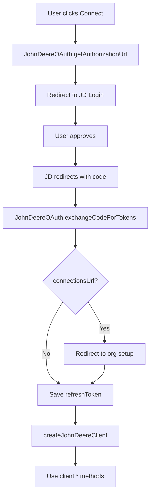

# API Reference

Complete API documentation for `@acreblitz/platform-integrations`.

## Overview

The package exports these main components:

### Unified Services (Provider-Agnostic)

| Export | Type | Purpose |
|--------|------|---------|
| `listFields` | Function | List fields from any provider |
| `getField` | Function | Get a single field |
| `listBoundaries` | Function | List boundaries from any provider |
| `getBoundary` | Function | Get a single boundary |

### Provider Registry

| Export | Type | Purpose |
|--------|------|---------|
| `getFieldAdapter` | Function | Get field adapter for a provider |
| `getBoundaryAdapter` | Function | Get boundary adapter for a provider |
| `registerFieldAdapter` | Function | Register custom field adapter |
| `registerBoundaryAdapter` | Function | Register custom boundary adapter |
| `getRegisteredProviders` | Function | List all registered providers |

### John Deere (Provider-Specific)

| Export | Type | Purpose |
|--------|------|---------|
| `JohnDeereOAuth` | Class | OAuth 2.0 flow helper |
| `createJohnDeereClient` | Function | Create authenticated API client |
| `JohnDeereError` | Class | Custom error type |
| `JD_OAUTH_ENDPOINTS` | Const | Default OAuth URLs |
| `JD_API_BASE_URLS` | Const | API base URLs |

## Quick Import

```typescript
import {
  // Unified Services (recommended)
  listFields,
  getField,
  listBoundaries,
  getBoundary,
  
  // Provider Registry
  getFieldAdapter,
  getBoundaryAdapter,
  registerFieldAdapter,
  getRegisteredProviders,
  
  // John Deere OAuth & Client
  JohnDeereOAuth,
  createJohnDeereClient,
  
  // Error handling
  JohnDeereError,
  
  // Constants
  JD_OAUTH_ENDPOINTS,
  JD_API_BASE_URLS,
  DEFAULT_PAGE_SIZE,
  DEFAULT_AREA_UNIT,
  
  // Types
  type JohnDeereClient,
  type ProviderType,
  type UnifiedField,
  type UnifiedBoundary,
  type PaginatedResult,
  type ListFieldsParams,
  type FieldAdapter,
  type BoundaryAdapter,
} from '@acreblitz/platform-integrations';
```

## Documentation

### Unified Services

- **[Services API](./services.md)** - Provider-agnostic field/boundary operations
  - `listFields()` - List fields with pagination, filtering, geometry
  - `getField()` - Get a single field by ID
  - `listBoundaries()` - List boundaries with pagination
  - `getBoundary()` - Get a single boundary by ID

### Provider Registry

- **[Provider Registry](./provider-registry.md)** - Adapter management
  - `getFieldAdapter()` / `getBoundaryAdapter()` - Get adapters
  - `registerFieldAdapter()` / `registerBoundaryAdapter()` - Register custom adapters
  - `getRegisteredProviders()` - List all providers
  - `isProviderFullySupported()` - Check provider support

### John Deere (Provider-Specific)

- **[JohnDeereOAuth](./john-deere-oauth.md)** - OAuth helper class
  - `getAuthorizationUrl()` - Generate auth URL
  - `exchangeCodeForTokens()` - Exchange code for tokens
  - `revokeToken()` - Revoke refresh token
  - `refreshAccessToken()` - Manually refresh token

- **[createJohnDeereClient](./john-deere-client.md)** - API client factory
  - `organizations.list()` / `.get()`
  - `fields.list()` / `.get()`
  - `boundaries.listForOrg()` / `.listForField()` / `.get()`
  - `operations.list()`

### Types

- **[Types Reference](./types.md)** - All TypeScript definitions
  - Unified types (UnifiedField, UnifiedBoundary)
  - Service parameter types
  - Adapter interface types
  - Provider-specific types

## Usage Flow



## Error Handling

All methods may throw `JohnDeereError`:

```typescript
try {
  const client = await createJohnDeereClient({ ... });
  const fields = await client.fields.list(orgId);
} catch (error) {
  if (error instanceof JohnDeereError) {
    // Handle based on error.code or error.status
    console.error(error.code, error.message);
  }
}
```

See the [Error Handling Guide](../guides/error-handling.md) for details.

## Environment Setup

Required environment variables:

```env
JD_CLIENT_ID=your_client_id
JD_CLIENT_SECRET=your_client_secret
JD_REDIRECT_URI=https://yourapp.com/callback
```

## Sandbox Testing

Use the sandbox API for development:

```typescript
// OAuth with sandbox
const oauth = new JohnDeereOAuth({
  clientId: process.env.JD_CLIENT_ID!,
  clientSecret: process.env.JD_CLIENT_SECRET!,
  redirectUri: process.env.JD_REDIRECT_URI!,
  apiBaseUrl: JD_API_BASE_URLS.SANDBOX,
});

// Client with sandbox
const client = await createJohnDeereClient({
  clientId: process.env.JD_CLIENT_ID!,
  clientSecret: process.env.JD_CLIENT_SECRET!,
  refreshToken: token,
  baseUrl: JD_API_BASE_URLS.SANDBOX,
});
```

